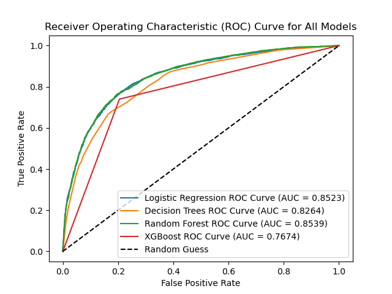

# **Predicting Uptake of Seasonal Flu Vaccine**

**Authors:**
1. Catherine Gakii
2. Waruchu Kuria
3. Michelle Mwendwa
4. Cleophas Opati
5. Felix Awino
6. Steven Kalungu
7. Tobias Ng'ong'a

# **Introduction**

## **Business Understanding**

## **Problem Statement**

Disease prevention is one key role of public health in addition to curative measures. Globally, vaccination is one of the public health departments' measures used to prevent infectious disease. This is because vaccines provide protection to individuals through immunity and the community at large through herd immunity. With this, little is known on how factors such as socioeconomic, behavioral, demographics, opinions on risks of illness and vaccines effectiveness and behavior towards mitigating tranmission influence the uptake of vaccines. 
Understanding how these factors influence the uptake of the vaccines can help the policy makers formulates effective policies aimed at increase of the uptake of the vaccines. The manufacturers will also gain insight into the total number of the vaccines to manufacture incases of the pandemics.

## **General Objective**

To understand which factors influence the uptake of the seasonal flu vaccine.

## **Specific Objectives**
1. To determine how socioeconomic factors influence an individual's uptake of the seasonal flu vaccines.
2. To evaluate how behavioral factors influence an individual's uptake of the seasonal flu vaccines.
3. To establish how demographic background factors influence an individual's uptake of the seasonal flu vaccines.
4. To understand how an individual's knowledge, perception, and attitude towards seasonal flu vaccines influence the uptake of the vaccines.

# **Data Understanding**
The data is composed of approximately 26,000 instances of individual data and vaccine decision information and the files obtained from DRIVENDATA(Source: CDC, NCRID and NCHS (2012), National 2009 H1N1 Flu Survey). This data was colleted over the phone between late 2009 and June 2010. Furthermore, the CRoss Industry Standard Process for Data Mining (CRISP-DM) was used for the analyzes of data. https://www.datascience-pm.com/crisp-dm-2/.

More data exploration revealed the following:

1. The train feature dataset contains 26707 rows and 36 columns;
2. The test dataset contains 26708 rows and 36 columns;
3. The target dataset contains 26707 rows and 3 columns.

The data was then cleaned and some columns were removed as needed.  

# **Modelling**
There are four main moddels that were used in this project:
1. Logistic Regression;
2. Decision trees;
3. Random forests;
4. XGBoost Algorithim.

# **Conclusion**
## **Model Evaluation Summary**
The Random Forest Model (best_model3) has demonstrated commendable performance in predicting the uptake of the seasonal flu vaccine. It has strong evaluation metrics and an ROC curve with strong discriminatory power. A better balance on the data may give more promising results.

# **Recommendations**
1. Embrace personalized outreach as a campaign tool so as to target individuals and mould their perception towards immunization.
2. Public campaigns should be geared towards bringing onboard more younger people as it seems that they are less likely to get the seasonal flu vaccines.
3. The public health sector should continue encouraging doctors to recommend suitable vaccines to their clients. This modelling and analysis process has shown that people are highly likely to listent ot their doctor's advice.

**For further improvements:**
1. Conduct more feature engineering to get more insight on features influencing uptake of the vaccine.
2. Using more recent data to create predictions, especially after the recent Covid-19 pandemic, may provide better outlooks on the results.

